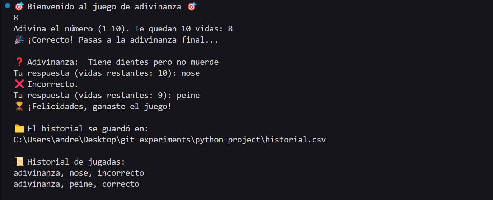

# Guessing Game in Python



## Description

This project is an interactive game developed in Python that combines two types of challenges: a number guessing game and a classic riddle challenge.

This is a **console-based game**, meaning all interactions occur through the terminal.

The game is divided into two main phases:

1. **Number Guessing**: The program randomly generates a number between 1 and 10. The player must guess the number with a maximum of 10 attempts. Each incorrect guess reduces one life. If the player guesses the number correctly before running out of lives, they advance to the next phase.

2. **Riddle Challenge**: In this phase, the player is presented with a classic riddle. The response is validated using regular expressions that search for a keyword in the user input. If the answer is correct, the game ends with a victory message. Otherwise, the player loses one life per incorrect answer until they run out of chances.

The project also includes a logging feature: all attempts are saved in a `historial.csv` file, including the type of guess, the user input, and whether it was correct or not.

---

## Game Rules

- The player starts with 10 lives.
- Each incorrect answer (in either phase) deducts one life.
- **Lives are not reset** between phases — they are shared across both challenges.
- The game ends when the player runs out of lives or completes both phases successfully.


## Running the Game

To run the project:


1. Make sure Python 3 is installed.
2. Clone the repository:
   ```bash
   git clone https://github.com/your-username/your-repo.git
3. Navigate to the project folder:
   ```bash
   cd your-repo
3. Open a terminal in the directory containing the `project.py` file.
4. Run the following command:

```bash
python project.py
```

The game will guide you through the steps. At the end, it will display a summary of your game attempts.

---

## Testing with pytest

The project includes automated tests for key functions using `pytest`. To run them, make sure `pytest` is installed:

```bash
pip install pytest
```

Then, from the same folder, execute:

```bash
pytest test_project.py
```

---

## Included Files

- `project.py`: Main game file. It includes:

  - `main()`: The entry point of the program. It initializes the game, controls the flow from the number guessing phase to the riddle phase, and finally displays the history log.
  - `adivinar_numero()`: Handles the number guessing logic. It generates a random number from 1 to 10 and allows the user to guess it within a certain number of attempts (lives). Each incorrect guess reduces one life, and every guess is logged.
  - `preguntar_adivinanza()`: Manages the riddle game phase. It randomly selects a riddle from a predefined dictionary. The user must guess the answer, and the answer is validated using regular expressions to check for the correct keyword. Incorrect answers reduce lives, and all attempts are logged.
  - `guardar_jugada()`: Saves each attempt to a CSV file.
  - `mostrar_historial()`: Reads and displays the game history.


- `test_project.py`: Test file. Contains tests for:

  - `es_numero_valido()`: Ensure correct input validation for numbers.
  - `comparar_respuesta()`: Verify riddle answers are correctly interpreted.
  - `resultado_a_texto()`: Check proper string output from boolean results.


- `historial.csv`: File generated automatically to log all game attempts.

---

## Design

- **Modularity**: The code is structured into small, reusable functions to improve readability, maintainability, and ease of testing.
- **No OOP**: Although an object-oriented approach could be used, a functional and straightforward structure was chosen to align with the course scope.
- **Regex Validation**: The `re` library is used to validate user inputs and check if the correct answer is present in the input, providing flexible text handling.
- **Data Persistence**: The built-in `csv` module is used to save game attempts, practicing basic file handling techniques.
- **Unit Testing**: Key functions are tested independently from the game logic to ensure reliability and meet course requirements.

---

## System Requirements

This project uses only standard Python libraries:

- `random`
- `re`
- `csv`
- `os`

No external dependencies are required.

---

## Credits

This game was developed as a final project for **CS50's Introduction to Programming with Python**. It represents a combination of skills learned throughout the course, including control structures, functions, file I/O, input validation, and automated testing.

